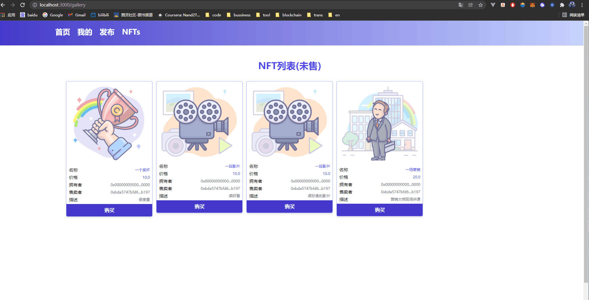

# 基于以太坊 Ethereum 和 IPFS 的 NFT 市场 DApp DEMO

> 此 demo 只用于参考学习，并只在本地环境测试过


### 主要功能

- 发布自己的 NFT 产品(目前仅限定于图片或文字)
- 在列表页中展示市场上所有待售的 NFT 资产
- 购买其余用户发布的 NFT 资产
- 在“我的”页面进行展示我发布过的 NFT 资产以及我购得的 NFT 资产

### 库和工具

- 钱包 MetaMask
- 合约 [Solidity](https://solidity-cn.readthedocs.io/zh/develop/index.html)
- 以太坊开发环境 [Hardhat](https://hardhat.org/)
- IPFS 存储第三方平台 [Pinata](https://www.pinata.cloud/)
- 前端 [Vue](https://v3.vuejs.org/) + [Vite](https://vitejs.dev/) + [Tailwindcss](https://tailwindcss.com/) + [Typescript](https://www.typescriptlang.org/)
- 其它相关库
  - [web3Modal](https://github.com/Web3Modal/web3modal)
  - [ethers.js](https://github.com/ethers-io/ethers.js)

### 启动流程
> 这里用的包管理工具为pnpm，也可以用yarn或npm
##### 1. 安装依赖
```
pnpm install
```
##### 2. 配置hardhat
```
// hardhat.config.js 具体配置项说明可查看hardhat文档
...
 defaultNetwork: "hardhat",
  networks: {
    hardhat: {
      chainId: 1342, //若填有此配置项 启动时会根据此配置项 启动对应chainId的节点
    },
  },
  solidity: {
    version: "0.8.4",
    settings: {
      optimizer: {
        enabled: true,
        runs: 200,
      },
    },
  }
...
```
##### 3. 通过hardhat启动节点
```
npx hardhat node 
```
##### 4. 编译&发布合约
```
npx hardhat  run --network localhost .\scripts\deploy.js
// 其中deploy.js中相关细节可查看hardhat文档
```
##### 5. 启动前端页面服务
```
pnpm run dev
```
##### 6. 访问本地端口进行测试 默认的地址为localhost:3000

### 演示




### 参考
-   [polygon-ethereum-nextjs-marketplace](https://github.com/dabit3/polygon-ethereum-nextjs-marketplace) -  dabit3

